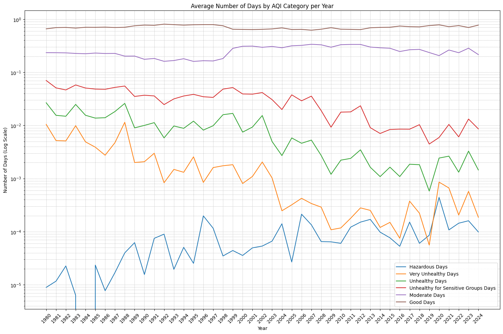

# AQI-by-EPA
This is a data analysis study I did on the US Environmental Protection Agency open dataset.

# Data Presentation

| **Column**                              | **Description**                                                                                                                                                                                    |
| --------------------------------------- | -------------------------------------------------------------------------------------------------------------------------------------------------------------------------------------------------- |
| **Days with AQI**                       | Total number of days in the year for which the Air Quality Index (AQI) was calculated.                                                                                                             |
| **Good Days**                           | Number of days the AQI was in the "Good" range (0–50), meaning air quality was satisfactory with little or no risk.                                                                                |
| **Moderate Days**                       | Number of days the AQI was in the "Moderate" range (51–100), which may pose a minor risk to a very small number of sensitive individuals.                                                          |
| **Unhealthy for Sensitive Groups Days** | Days when AQI was in the 101–150 range, where sensitive individuals (e.g., elderly, children, those with asthma) may experience health effects, but the general public is unlikely to be affected. |
| **Unhealthy Days**                      | Days with AQI in the 151–200 range. Everyone may begin to experience health effects, and members of sensitive groups may experience more serious effects.                                          |
| **Very Unhealthy Days**                 | Days with AQI between 201–300. Health alert: everyone may experience more serious health effects.                                                                                                  |
| **Hazardous Days**                      | Days with AQI above 300. Health warnings of emergency conditions: the entire population is more likely to be affected.                                                                             |
| **Max AQI**                             | The highest (worst) AQI value recorded for the county during the year.                                                                                                                             |
| **90th Percentile AQI**                 | The AQI value below which 90% of the daily AQI values fall. This gives an idea of how bad AQI gets on the worse days, without considering extremes.                                                |
| **Median AQI**                          | The middle AQI value for the year—half of the AQI values were above this, and half were below.                                                                                                     |
| **Days CO**                             | Number of days where carbon monoxide (CO) was the primary pollutant determining the AQI.                                                                                                           |
| **Days NO2**                            | Number of days where nitrogen dioxide (NO₂) was the primary pollutant determining the AQI.                                                                                                         |
| **Days Ozone**                          | Number of days where ground-level ozone was the dominant pollutant affecting the AQI.                                                                                                              |
| **Days PM2.5**                          | Number of days where fine particulate matter (PM2.5) was the primary pollutant.                                                                                                                    |
| **Days PM10**                           | Number of days where coarse particulate matter (PM10) was the primary pollutant.                                                                                                                   |

# A Warning

First thing, there's a problem evidenced in the 'Days with AQI' column. Some rows have a low amount of days measured, which can skew the data.

Example:
| State  | County | Year | Days with AQI | Good Days | Moderate Days | Unhealthy for Sensitive Groups Days | Unhealthy Days | Very Unhealthy Days | Hazardous Days |
| ------ | ------ | ---- | ------------- | --------- | ------------- | ----------------------------------- | -------------- | ------------------- | -------------- |
| Montana|	  Park|	 1988|	           36|	     26.0|	          7.0|                                	1.0|	           1.0|	                 0.0|            	1.0|

This data, would make us assume that in 1988, Park, Montana had either 1 Hazardous Day or even ~3% hazardous days in that year, both which can't be assumed. This issue is addressed in the code, when necessary.

# Average of Air Quality throughout the years

## 1st Step
Get the weighted AQI value of each 'State' by getting the sum() of all 'County's by 'Year' and dividing by the sum() of Days of measured AQI. Example:

| State  | County | Year | Days with AQI | Good Days |
| ------ | ------ | ---- | ------------- | --------- |
| Montana|	  Park|	 1988|	           36| 26        |
| Montana| Cascade|	 1988|	          206|   178     |

Calculating:

$$X_{Waqi} = \frac{26+178}{36+206} = \frac{204}{242} = 0.8429752$$

Would result in one row such as:
| State  | Year | Proportion of Good Days |
| ------ | ------ | ---- |
| Montana|	 1988| 0.84        |

## 2nd Step
Get the average value of the entire country by getting the average of all 'State's by 'Year' (Group by 'Year', merging all 'State's and aggregating columns by the average).

## 3rd Step: Plot

We can observe that the average number of Hazardous days has been steadily increasing over the years, likely encroaching on the number of Very Unhealthy days, which have been on the decline.

In 1999, the balance between Good and Moderate days—which had already been fluctuating since around 1988–1989—was noticeably disrupted. A brief investigation suggests that widespread wildfires in the western U.S., along with tornadoes and thunderstorms, may have influenced the air quality measurements that year.

Despite this setback, the proportion of Good to Moderate days has since been recovering.
